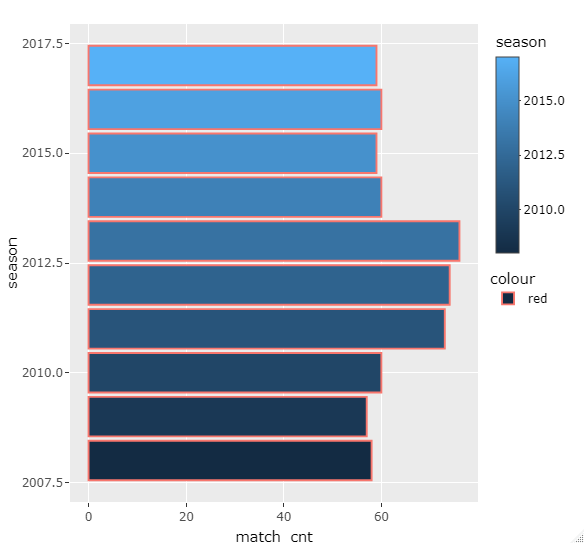
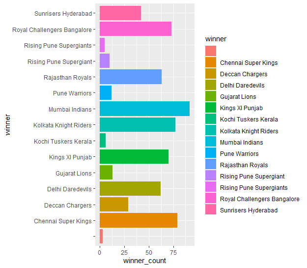

# IPl_data_set Analysis

img_ref:Exchange4media

## Inroduction

Now that this year's IPL is over, let's not curb our cricket love and start analyzing the whole of IPL with this latest and complete Indian Premier League dataset. It contains the match descriptions, results, winners, player of the matches, ball by ball dataset and much more. So, stop thinking and start analyzing .

## About Data Set

The data set includes information about: Ipl data set till 2017.following aew the attributes of the data sets.

The features present in the data are:

id-Numeric attribute.

Season-year of the match.

city-city name.

date-date of match.

team1-team one.

team2-team two.

toss_winner - team who won the toss.

toss_decision-whether the team selected to bat or bowl.
 
result-whether the match or seleccted ot cancled.

dl applied or not.

win_by_runs
.
win_by_wickets

player_of_the_match.

venue.

umpire1.

umpire2.

umpire3.

you can download the data-set by [clicking on this link](https://www.kaggle.com/datasets/patrickb1912/ipl-complete-dataset-20082020).

## Business task
The goal of this case study is to provide clear insightsby finding these:

* [How many seasons we’ve got in the dataset?]

* [Which Team had won by maximum runs?]

* [Which Team(s) had won by maximum wicket?]

* [Which Team(s) had won by closest Margin (minimum runs)?]

* [Which Team had won by minimum wicket?]

* [Which Season had most number of matches? and Barplot for season with more matches.]

* [Which IPL Team is more successful?]

* [Barplot for team who won max matches]


## Preparing The data

This case study uses Ipl match data set  to analyze. The data has been made available by kaggle.com. under and open license. The data can be dowloaded from [here](https://www.kaggle.com/datasets/patrickb1912/ipl-complete-dataset-20082020).

This data is reliable, original, comprehensive and current as it is internally collected and stored safely by Ipl from year 2008 to May 2017. 

The data selected for use covers total 9 years of data from year 2008 to 2017. There are intotal 2 Data sets used named 'Deliveries' and 'Matches' . The datasets are organized in tabular format and have 21 identical columns in deliveries ddataset and 18 identical columns in matches dataset. Used both of the datasets purposefully to extrct the required data.Ther are 3 similar columns from each data set which help to extrat my required data in easiest way.

## Processing the data from dirty to clean 

### Tools

To process the data from dirty to clean, I chose to use **R.** This is because R is relatively fast and thus useful in dealing with huge dasets. R is also heavily supported by handy open-source Packages such as tidyvers,dplyr,ggplot2

### Cleaning And Transforming data 
First I upload both  data set  of .csv format in R studio.During the next step I checked all columns and few rows of both datasets and rename some column names of matches.csv dataset based on the similarity of rows in deliveries.csv data set
Next I check data types of both datasets and then replace data types of some columns
```R
install and load packages to wrangle data and date attributes
install.packages("tidyverse") # Helps to wrangle data
library(tidyverse)
library(lubridate) #Helps wrangle date attribues
install.packages("here")
library(here)
# insall and load packages to simplify data cleaning tasks and functions for cleaning data
install.packages("skimr")
install.packages("janitor")
library(skimr) #Helps to simplifying data cleaning tasks
library(janitor) #Gives funcions for cleaning data
library(dplyr)
library(readr)
#now all important packages are installed and loaded.Now lets move towards further steps for cleaning analyzing and visualizing data

##########################################################################################
#Loading data sets
deliveries <- read.csv('deliveries.csv')
matches    <- read.csv('matches.csv')  

#checking for common coklumns in each dataframe
head(deliveries)
head(matches)
#after checking both rows and column we can se that trip id,batting team and bowling team in deliveries dataframe and Id,team1 and team2 in matches datarame are similar
#renaming in matches dataframe 
matches = matches %>% rename(bowling_team= team1,batting_team= team2)
view(matches)
```
## Analyzing and Visualizing Data to Answer Questions

In this step, I analyzed the cleaned data to find answers of the businesstask  differently.

These are the my findings if the given business task after cleaning and analyzing data:-

How many matches we’ve got in the dataset?
```R
# calculating total no of matches played 
total_no_matches_played <- count(matches)
total_no_matches_played
```


Total Number of season ?
```R
#counting total no of seasons 
season_count = length(unique(matches$season))
```


Which Team(s) had won by maximum Runs?
```R
#team win by maximum no of runs
runs_max = matches[which.max(matches$win_by_runs),]
# this will display a full row but we want values in particular columns
runs_max %>% select('winner','win_by_runs') # this will give us two column winner and winner by runs
```


Which Team(s) had won by maximum wicket?
```R
#win by maximum wickets
wic_max = matches[which.max(matches$win_by_wickets),]
wic_max%>% select('winner','win_by_wickets')
```


Which Team(s) had won by minimum wickets?
```R
#win by minimum wickets
matches %>% filter(win_by_wickets != 0) %>% filter(win_by_wickets == min(win_by_wickets)) %>% select('winner','win_by_wickets')
```


Which Team had won by minimum runs?
```R
#win by minimum runs
matches %>% filter(win_by_runs != 0) %>% filter(win_by_runs ==min(win_by_runs)) %>% select('winner','win_by_runs')
````


Which Season had most number of matches? and Barplot for season with more matches.
```R
season_mt_cnt = matches %>% group_by(season) %>% summarise(match_cnt = n()) %>% ggplot() + geom_bar(aes(season,match_cnt, fill = season,color = 'red'), stat = 'identity')+ coord_flip()
ggplotly(season_mt_cnt)
```



Which IPL Team is more successful?
```R
#most successfull team
 matches %>% group_by(winner) %>% summarise(winner_count = n()) %>% filter(winner_count==max(winner_count))
 ```
 
Barplot for team who won max matches
```R
# visualiszation for teams that won maximum matches
 matches %>% group_by(winner) %>% summarise(winner_count = n()) %>% ggplot() +geom_bar(aes(winner,winner_count,fill = winner),stat = 'identity')+coord_flip()
 ```
 


